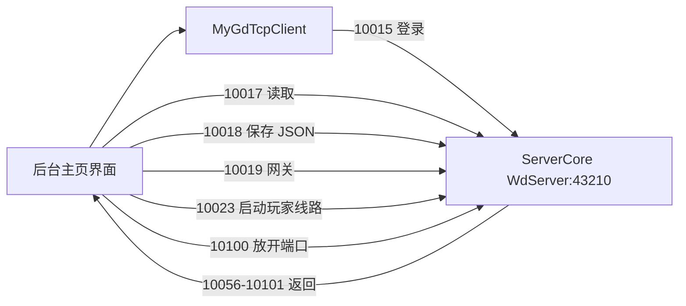

# 后台管理架构与职责

## 后台是什么

`顺风插件管理后台.exe` 是 Windows Forms 控制面。它通过 TCP RPC 连接 Linux 上的 `ServerCore:43210`，负责展示状态、编辑配置和发送管理命令。它不代理玩家游戏数据，也不直接替代游戏服务。



## 启动和连接

| 入口 | 作用 |
| --- | --- |
| `admin-source/current/NetClientFrom/Program.cs:20` | 读取本地 `Config.json`，初始化内置资源路径，启动主窗体 |
| `NetClientFrom.后台主页界面.后台主页界面_Load():4367` | 初始化日志、心跳、界面和本地配置 |
| `NetClientFrom.后台主页界面.连接校验():6571` | 使用界面填写的 IP、端口连接插件 |
| `MyGdTcpClient.验证连接事件():15` | 连接后发送 `10014` 心跳/初始连接 |
| `10015` | 提交授权卡密、管理员账号和密码；卡密或租约无效时拒绝进入后台 |

后台本地连接配置模型：

```csharp
public class Config
{
    public string IP = "127.0.0.1";
    public ushort Port = 43210;
    public string Admin = "admin";
    public string PassWord = "123456";
}
```

## 主窗体职责

`NetClientFrom.后台主页界面` 是后台总控制器，扫描到 2,332 个成员和 189 个事件方法，主要负责：

- 插件连接、管理员登录、日志和运行状态。
- 基础配置、数据库、游戏线路和后台端口配置。
- 启动/停止登录网关、启动玩家代理线路、放开玩家端口。
- 在线角色监控、发货、强制下线、调试数据和 GM 注册。
- CDK 生成、刷新、删除和兑换管理。
- 商城、奇宝斋、邮件、点卡、累充、合区和活动控制。
- 将复杂配置窗口打开、回填、保存和重新加载。

关键按钮：

| 方法 | 协议 | 作用 |
| --- | ---: | --- |
| `基础_启动服务端按钮_Click():5280` | `10023` | 启动玩家 TCP 代理线路 |
| `基础_放开端口按钮_Click():5262` | `10100` | 请求插件执行 Linux 端口规则 |
| `返回放开端口(bool 是否成功, string 提示信息):5271` | `10101` | 展示端口规则执行结果 |
| `返回获取配置(bool Is成功, int 配置类型, string 配置内容):6712` | `10059` | 按类型反序列化配置并更新界面 |
| `返回保存配置(string value):6706` | `10060` | 展示插件保存结果 |

## 配置窗口

后台为复杂玩法提供独立窗口，包括：

- 元神境界、限时副本地图、BOSS、超级地图、超级 NPC。
- 属性洗炼、时装染色、超级道具、百炼、盲盒、宠物召唤。
- 六道轮回、浮生录、异兽录、无双、试道、签到和活跃奖励。
- 邮箱、商城限购、推荐拉人、道行达标、通天塔和特权会员。

全部窗口、源码路径和事件数量见 `generated/admin-forms.md`；所有按钮参数见 `generated/event-handlers.csv`。

## 配置读写约定

后台与插件共享 `ServerCoreLK.csproj` 中的配置模型：

1. 点击重载时发送 `SendRT(10017, 配置类型)`。
2. 插件返回 `10059(bool 成功, int 配置类型, string JSON)`。
3. 后台反序列化为对应配置类并绑定控件。
4. 点击保存时先提交表格编辑状态，再序列化配置。
5. 发送 `SendRT(10018, 配置类型, JSON)`。
6. 插件落盘、替换运行时配置并返回 `10060`。

配置编号不可在窗口里随意硬编码新值。先查 `generated/config-protocol.md`，再同步 `AllEnums.后台通信类型`、插件 `WdServer` 和后台窗口。

## 内置服务器脚本资源

后台工程嵌入了多组 `.o` 资源，例如 `logind.o`、`heartbeatd.o`、`stalld.o`、`tongtianta.o` 等，并在 `全局变量类.初始化O路径()` 中映射到游戏服务端 PAK 路径。相关功能属于服务器脚本文件部署/替换工具，不是插件 DLL 注入。

## 修改后台时的边界

- 修改一个功能窗口时，优先查该窗口事件和对应配置类型，不要先进入 28,000 行主窗体盲查。
- 新增配置字段必须同时修改共享模型、插件默认配置/加载逻辑、后台控件绑定和保存逻辑。
- 新增 RPC 必须定义 `MyCmd` 常量、插件 `[Rpc]` 方法、后台发送调用和返回回调。
- 表格保存前要调用 `EndEdit/CommitEdit` 或显式同步当前单元格，避免界面显示值未进入配置对象。
- 后台发布仍是 `win-x64` 自包含单文件；插件发布是 `linux-x64` 自包含单文件。
