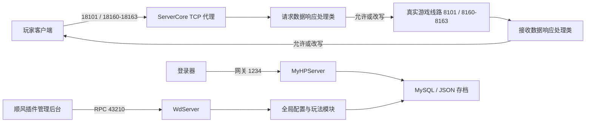

# 插件架构与职责

## 插件是什么

`ServerCore` 是运行在 Linux 服务器上的独立进程，不是注入游戏进程的 DLL。它同时承担四类职责：

1. 在玩家客户端与真实游戏服务之间建立 TCP 代理线路。
2. 解析、检查、修改并转发双向游戏封包，实现额外玩法和修复。
3. 提供 `43210` 管理 RPC 服务，供桌面后台读取配置、保存配置和执行管理操作。
4. 连接 MySQL 并保存插件扩展的角色、宠物、活动、商城和功能存档。



## 启动链

| 阶段 | 入口 | 作用 |
| --- | --- | --- |
| 进程入口 | `plugin-source/v10-source-restoration/Program.cs:5` | 处理三组自测参数，然后进入恢复后的真实入口 |
| 运行时入口 | `vEAdPGPTkDFOYsbi303.mEdebOPadFyb5ykL5Wy.cGgPVyYtIA` | 初始化日志、进程状态和后台 RPC 服务 |
| 配置和数据初始化 | `MainService.ReadMianConfig():395` | 读取主配置、全部玩法配置、限时副本、枚举数据和数据库存档 |
| 后台 RPC 监听 | `WdServer` | 监听 `MainConfig.后台管理端口`，默认 `43210` |
| 玩家线路启动 | `MainService.Init(string 真实游戏IP, Action<bool,string>):27` | 根据插件端口和游戏端口创建一组 TCP 转发服务 |
| 登录网关 | `MyHPServer.启动网关():32` | 监听 `网关配置.网关端口`，线上通常为 `1234` |

## 核心模块

### `MainService`

- 启动、停止玩家代理线路。
- 维护插件端口到真实游戏端口的映射。
- 查询在线玩家会话。
- 向全部玩家或指定玩家发送封包。
- 统一发送等级、道行、经验、元宝、金钱、道具、宠物、坐骑、奇宝点、灵气值等收益。

常用 API：

```csharp
bool 发送角色属性道具(
    MyNATSocketClient myclient,
    AllEnums.数值Type 发送类型,
    int 发送数量 = 1,
    string 道具名字 = "",
    string 提示文本 = "")
```

定义：`plugin-source/v10-source-restoration/MainService.cs:282`。

### `MyNATService` / `MyNATSocketClient`

- 每条线路对应一个 `MyNATService` 监听端口。
- 玩家连入后创建 `MyNATSocketClient`，再连接真实游戏端口。
- 会话对象保存账号、角色、地图、战斗、背包、宠物和插件扩展存档。
- 双向数据分别进入请求和接收处理中心。

### 游戏封包分发

| 方向 | 入口 | 参数 | 用途 |
| --- | --- | --- | --- |
| 客户端到游戏服 | `请求数据响应处理类.请求处理中心` | `MyNATSocketClient myclient, byte[] buffer` | 识别 `AllEnums.请求包头枚举`，处理登录、角色、背包、装备、战斗、商城、NPC 和玩法请求 |
| 游戏服到客户端 | `接收数据响应处理类.接收处理中心` | `ref bool allow, MyNATSocketClient myclient, byte[] buffer, byte[] packType = null` | 识别 `AllEnums.接收包头枚举`，更新角色缓存、修改响应、追加界面或奖励封包 |
| 封包构造 | `WdAPI` | 164 个可索引成员 | 构建提示、属性、物品、NPC、战斗和界面封包 |
| 字节读写 | `ByteAPI`、`封包_读`、`封包_写` | 见 `symbols.csv` | 字节序、文本、整数、查找、拼包和拆包 |

封包编号在 `plugin-source/v10-source-restoration-lk/AllEnums.cs`。`switch-dispatch.csv` 已将每个 `case` 与调用方法关联。

### `WdServer` 管理 RPC

`WdServer` 是后台控制面服务端。主要协议：

| 协议 | 参数 | 作用 |
| ---: | --- | --- |
| `10015` | `Player, string 授权卡密, string 管理员账号, string 管理员密码` | 先校验卡密和在线租约，再登录后台 |
| `10017` | `Player, int 配置类型` | 读取配置 JSON |
| `10018` | `Player, int 配置类型, string 配置JSON` | 保存并重新加载配置 |
| `10019` | `Player, bool 启动` | 启动或关闭登录网关 |
| `10020` | `Player, bool 请求状态` | 获取插件运行、内存、到期状态等基本信息 |
| `10022` | `Player, bool 保存` | 保存全部玩家存档 |
| `10023` | `Player, string 参数1, string 固定校验参数` | 启动玩家代理线路 |
| `10024` | `Player, bool 重启` | 保存存档并重启插件 |
| `10100` | `Player` | 执行玩家端口放行规则 |

全部请求和返回参数见 `generated/rpc-catalog.md`。

### 配置体系

- `MainConfig`：数据库、后台端口、游戏地址、代理端口、管理员、基础开关和基础奖励。
- `网关配置`：注册、出生位置、注册赠送、防 CC、验证码、网关共享配置。
- `全局变量类`：持有所有玩法配置实例、在线会话、地图、NPC、角色/宠物存档和运行状态。
- 玩法配置由后台用 JSON 通过 `10017/10018` 读取和保存。
- `AllEnums.后台通信类型` 当前覆盖 `0-74`，限时副本额外使用独立类型 `1000`。

完整字段、类型和默认值见 `generated/config-fields.csv`；编号和后台按钮见 `generated/config-protocol.md`。

### 数据库和存档

- `DB.cs` 是主要 MySQL 数据访问集中点，扫描到 322 个数据库 API 调用。
- `DB.fwlNbKZtLa():149` 建立主数据库连接配置。
- `DB.vWiNp7QZQV():4649` 和其他恢复名称方法负责加载不同存档集合。
- `DB.oSPiJX3g49():5772` 保存全部玩家存档。
- 插件同时使用 JSON 配置文件保存玩法配置，限时副本使用 `timed-dungeon.json`。

数据库方法位置见 `generated/database-calls.csv`。由于 SQL 字符串大多运行时解码，修改表结构时必须沿调用方法核对参数和读取列顺序。

## 玩法能力

当前源码包含的主要能力可按以下类别查找：

- 账号与运营：注册、GM、CDK、点卡、累充、内充、商城、奇宝斋、邮件、排行榜、合区。
- 地图与活动：限时副本、超级地图、超级 NPC、世界/龙血/智能 BOSS、试道、无双、通天塔、泡点、日常、签到、在线抽奖、南极抽奖。
- 角色成长：元神境界、轮回转世、异兽录、浮生录、妖族化形、门派转换、道行达标、等级道行限制。
- 装备系统：装备升阶、强化、分解、进化、首饰、属性洗炼、特效鉴定、灵幡、本命法宝。
- 宠物和伙伴：宠物召唤、突破、转生、绑定、同源、自定义宠物、守护、娃娃、坐骑。
- 经济和奖励：盲盒、百炼、鸿运当头、天机神算、自助商店、道具宠物回收、礼包和飘屏。
- 定制功能：VIP、巅峰对决、道友挖宝、LGL 定制、怀旧专区、道北砍尾等功能标志。

## 当前维护边界

- 生产业务已能从源码修改并重新编译，不再采用二进制修改或 DLL 注入。
- 混淆方法必须通过调用链、RPC 编号、封包枚举和功能配置定位，禁止仅凭名称猜测。
- 新增封包功能要同时检查请求方向、接收方向、角色缓存和真实游戏服返回。
- 修改配置协议必须同步插件、后台、`AllEnums.后台通信类型` 和回归脚本。
- 修改数据库写入必须与服务器实际表结构和默认值同步验证。
